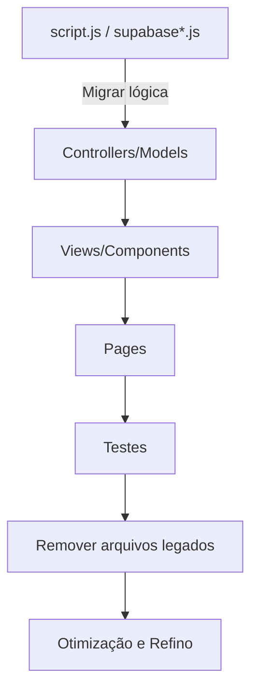

# Estrutura MVC - IkigaiHub

## Visão Geral

O projeto IkigaiHub está em migração para o padrão Model-View-Controller (MVC) para melhorar a organização, manutenibilidade e escalabilidade do código. A estrutura de diretórios já está consolidada e parte das funcionalidades já foi migrada.

## Estrutura de Diretórios

```
plano_alimentar/
├── models/                 # Camada de dados
│   ├── NotaModel.js
│   ├── PreferenciaModel.js
│   ├── ReceitaModel.js
│   └── TarefaModel.js
├── controllers/            # Camada de lógica de negócio
│   ├── NotaController.js
│   ├── PreferenciaController.js
│   ├── ReceitaController.js
│   └── TarefaController.js
├── views/                  # Camada de apresentação
│   ├── components/         # Componentes reutilizáveis
│   │   ├── NotaCard.js
│   │   ├── ReceitaCard.js
│   │   └── TarefaCard.js
│   └── pages/              # Páginas específicas
│       ├── NotasPage.js
│       ├── PlanoAlimentarPage.js
│       ├── ReceitasPage.js
│       └── TarefasPage.js
├── services/               # Serviços externos
│   └── SupabaseService.js
├── utils/                  # Utilitários e constantes
│   ├── constants.js
│   └── helpers.js
├── app.js                  # Aplicação principal
├── script.js               # Funcionalidades não migradas (legado)
├── supabaseNotas.js        # Módulos legados
├── supabasePreferencias.js
├── supabaseReceitas.js
├── supabaseTarefas.js
├── style.css               # Estilos globais
└── [outros arquivos]
```

## Progresso da Migração

- Estrutura de diretórios padronizada e implementada.
- Funcionalidade de receitas já migrada para MVC (model, controller, view/component e página).
- Modelos e controllers para Notas, Preferências e Tarefas já criados.
- Views/páginas para Receitas, Notas, Tarefas e Plano Alimentar já existem.
- Serviços e utilitários centralizados.
- Arquivos legados mantidos para compatibilidade.

## Fluxo de Dados (MVC)

```
1. Usuário interage com View (ex: ReceitaCard)
2. View dispara evento customizado
3. Controller (ex: ReceitasPage) captura evento
4. Controller chama Model (ex: ReceitaModel)
5. Model executa operação no Service (SupabaseService)
6. Service retorna dados para Model
7. Model formata e retorna para Controller
8. Controller atualiza View
```

## Migração Gradual

### Fase 1: Estrutura Base ✅
- [x] Criar estrutura de diretórios
- [x] Implementar utilitários base
- [x] Criar SupabaseService
- [x] Implementar ReceitaModel e ReceitaController
- [x] Criar componentes de view para receitas

### Fase 2: Integração (em andamento)
- [x] Implementar modelos para Tarefas e Notas
- [x] Criar controllers para Tarefas e Notas
- [x] Criar views/pages para Tarefas, Notas, Plano Alimentar e Preferências
- [ ] Migrar lógica dos arquivos legados (script.js, supabase*.js) para os novos controllers/models/services
- [ ] Refatorar views/componentes antigos para usar a nova arquitetura

### Fase 3: Otimização
- [ ] Modularizar CSS (separar estilos por componente/página)
- [ ] Implementar sistema de cache
- [ ] Adicionar lazy loading
- [ ] Otimizar performance
- [ ] Implementar testes unitários e de integração

## Próximos Passos

1. **Migrar Notas e Tarefas para MVC por completo**: Garantir que NotasPage.js e TarefasPage.js consumam seus respectivos controllers/models e que os componentes estejam desacoplados.
2. **Refatorar Preferências**: Criar página e componentes para Preferências seguindo o padrão MVC.
3. **Eliminar dependências de arquivos legados**: Migrar toda a lógica relevante de script.js e supabase*.js para os novos controllers/models/services e remover gradualmente os arquivos legados.
4. **Modularizar o CSS**: Separar estilos por componente/página.
5. **Implementar testes unitários e de integração**: Cobrir as principais funcionalidades.
6. **Otimizar performance**: Implementar cache, lazy loading e revisar pontos de gargalo.
7. **Aprimorar tratamento de erros e logs**: Centralizar tratamento de erros e adicionar logs detalhados.
8. **Atualizar documentação e exemplos de uso**: Garantir que a documentação reflita o padrão e fluxo atual.
9. **Planejar remoção dos fallbacks**: Após migração completa, remover sistemas de fallback e garantir uso exclusivo da nova arquitetura.

## Resumo Visual do Fluxo de Migração



## Compatibilidade

- `script.js` e `supabase*.js` mantidos para funcionalidades não migradas
- `style.css` preservado até modularização completa
- Sistema de fallback no `index.html` garante funcionamento durante a migração

## Exemplo de Uso

```javascript
// Inicializar aplicação
import App from './app.js';
const app = new App();

// Usar controller diretamente
import ReceitaController from './controllers/ReceitaController.js';
const controller = new ReceitaController();
const receitas = await controller.carregarReceitas();

// Usar componente de view
import ReceitaCard from './views/components/ReceitaCard.js';
const card = new ReceitaCard();
const elemento = card.render(receita, index, secao);
```

## Considerações Técnicas

- Uso de módulos ES6 (`import/export`)
- Comunicação entre componentes via eventos customizados
- Tratamento de erros centralizado
- Debounce, throttle, lazy loading e cache para performance
- Testabilidade e modularidade como foco 